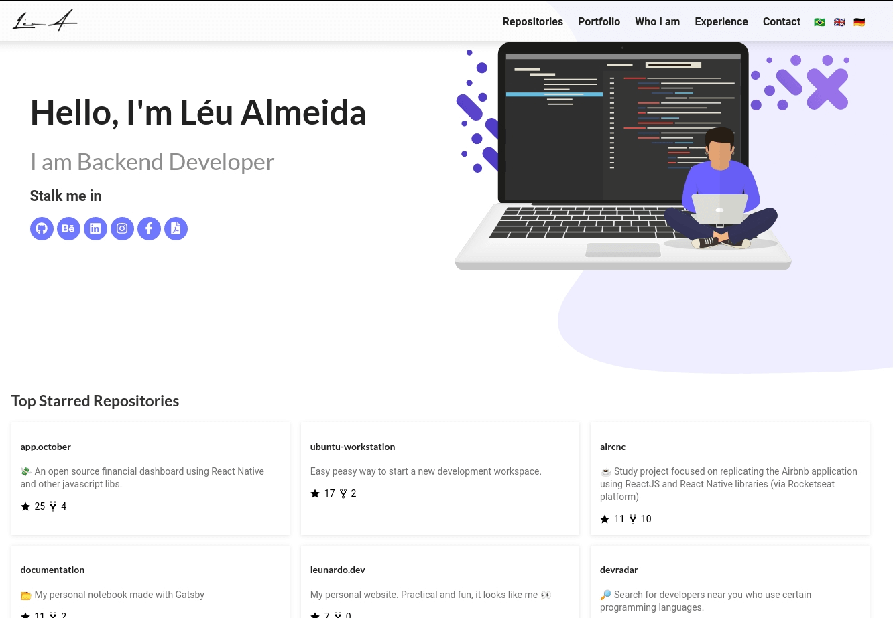

<p align="center">

</p>

<h1 align="center">Personal Portfolio</h1>

<blockquote align="center">
My personal website. Practical and fun, it looks like me 👀
</blockquote>

<p align="center">
  

  

  <a href="https://leunardo.dev">
    
  </a>
</p>

<p align="center">

</p>

## :electric_plug: Prerequisites

- [Node.js LTS (>= 10.x)](https://nodejs.org/)
- [Yarn (>= 1.21)](https://yarnpkg.com/) or [NPM (>= 6.9)](https://www.npmjs.com/)
- [Gatsby CLI >= 2.8.x](https://www.gatsbyjs.org/docs/quick-start/#install-the-gatsby-cli)

### :closed_lock_with_key: Getting started the application

Make a clone from the repo and install the dependencies

```shell
# First of all, clone the project
$ git clone https://github.com/LeuAlmeida/leunardo.dev

# Enter in the application folder
$ cd leunardo.dev

# Install all dependencies using Yarn (or $ npm install if may you are using NPM)
$ yarn

# Run the application in your machine
$ yarn start

```

## :copyright: License

MIT License.

See [LICENSE](LICENSE.md) for details.

<hr/>

<h4 align="center">
<a href="http://linkedin.com/in/leonardoalmeida99">Connect me in LinkedIn</a> | <a href="http://behance.net/almeida99">See my Behance</a> | <a href="https://leunardo.dev">Click here to go to my CV</a>
</h4>

<p align="center">
This portfolio was made from the <a href="https://github.com/smakosh/gatsby-portfolio-dev"><b>Gatsby Portfolio Dev Template</b></a>. Thank you Smakosh! 💖
</p>
